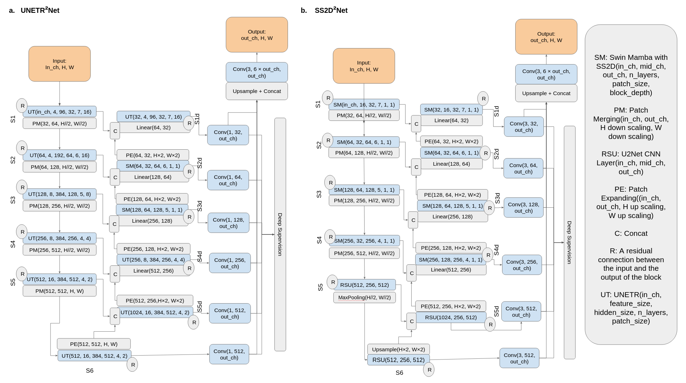
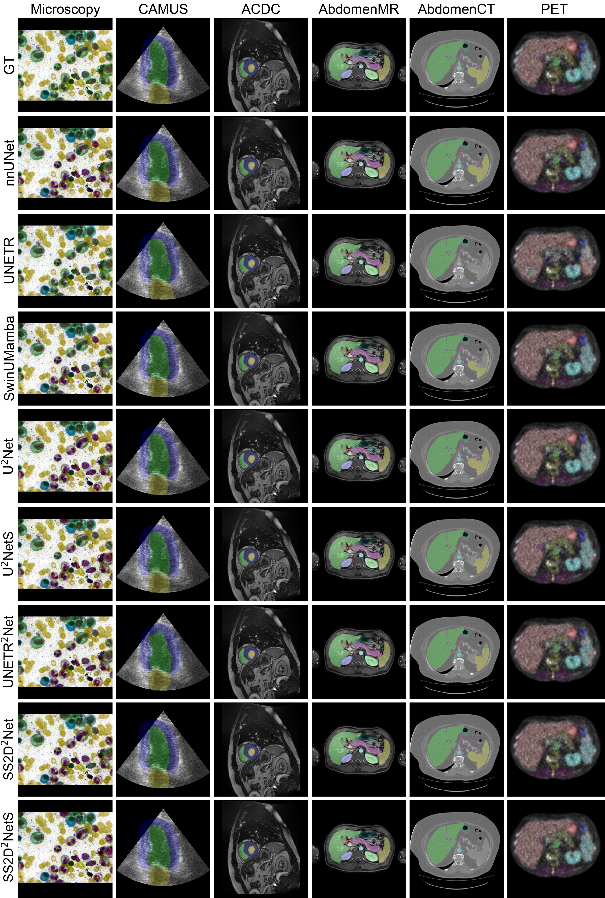

# nnUZoo


## Contents

- [Overview](#overview-)
- [System Requirements](#system-requirements)
- [Installation Guide](#installation-guide)
- [Train](#train)
- [Test](#test)
- [X2Net](#x2net-)
- [Results](#results)
- [License](#license)
- [Citation](#citation)

# Overview

...

# System Requirements

## HardWare Requirements

- Train Requirements
    - Minimum RAM of 24 GB
    - Minimum CPU of 8 Cores
    - A decent GPU with minimum of 24 GB VRAM such as Nvidia-4090, A6000, A100, etc.
- Inference Arguments
    - Minimum RAM of 8 GB
    - Minimum CPU of 4 Cores
    - For a faster inference and for Mamba models a GPU can be used however it's not necessary.

## Software Requirements

### OS Requirements

The developmental version of the code has been tested on the following systems:

* Linux: Ubuntu 22.04, Ubuntu 24.04, Pop!_OS 22.04
* Mac OSX: Not tested
* Windows: Not tested

The codes with CUDA should be compatible with Windows, Mac, and other Linux distributions.

# Installation Guide

## Cuda Installation

- To install cuda, please refer
  to [cuda-installation-documents](https://docs.nvidia.com/cuda/cuda-installation-guide-linux/)
- To install Mamba, please refer
  to [mamba-installation-documents](https://github.com/state-spaces/mamba?tab=readme-ov-file#installation)

## Library Installation

```commandline
pip install -r requirements.txt
pip install ./nnUNet
```

## Train

To train any of the models, the dataset should be in the nnunetv2 format.

```commandline
├── nnunet_raw
│   ├── Dataset030_AbdomenMR
│   │   ├── imagesTr
│   │   │   ├── amos_0507_0000.nii.gz
│   │   │   ├── ...
│   │   ├── labelsTr
│   │   │   ├── amos_0507.nii.gz
│   │   │   ├── ...
│   │   ├── imagesTs
│   │   │   ├── amos_0507_0000.nii.gz
│   │   │   ├── ...
│   │   ├── labelsTs
│   │   │   ├── amos_0507.nii.gz
│   │   │   ├── ...
```

Then run the following code to train a model:

```commandline
python train.py --device 1 --dataset_name  Dataset030_AbdomenMR --tr nnUNetTrainerM2NetP --model 2d --num_epochs 250
```

For more variable please run `python train.py --help`

## Test

For test execute the following command:

```commandline
python run_test.py --dataset_name Dataset030_AbdomenMR --device 1 --model_name M2Net 
```

For more variable please run `python train.py --help`

## X2Net

Here we present the graph of the two of our proposed models:



## Results

Here is the dice scores of various models:

|              | Microscopy     | CAMUS          | ACDC           | AbdomenMR      | AbdomenCT      | PET            |
|:-------------|:---------------|:---------------|:---------------|:---------------|:---------------|:---------------|
| nnUNet       | 0.69  0.20     | **0.92  0.03** | **0.92  0.03** | **0.74  0.11** | 0.78  0.08     | **0.73  0.04** |
| UNETR        | **0.72  0.23** | 0.89  0.04     | 0.89  0.04     | 0.56  0.18     | 0.47  0.20     | 0.50  0.03     |
| SwT          | 0.66  0.21     | 0.89  0.04     | 0.91  0.03     | 0.61  0.14     | 0.60  0.13     | 0.50  0.03     |
| SwinUMamba   | 0.70  0.21     | **0.92  0.03** | 0.90  0.03     | 0.73  0.13     | 0.78  0.09     | 0.71  0.04     |
| LightUMamba  | 0.70  0.22     | 0.91  0.03     | **0.92  0.02** | 0.71  0.15     | 0.73  0.11     | 0.71  0.04     |
| U<sup>2</sup>Net     | 0.70  0.21     | **0.92  0.03** | **0.92  0.03** | 0.73  0.15     | 0.78  0.08     | 0.72  0.04     |
| U<sup>2</sup>$NetS    | 0.69  0.22     | 0.91  0.04     | **0.92  0.03** | 0.72  0.13     | 0.71  0.10     | 0.65  0.04     |
| UNETR<sup>2</sup>$Net | 0.68  0.23     | 0.87  0.05     | 0.91  0.03     | 0.65  0.15     | 0.69  0.13     | 0.66  0.04     |
| SwT<sup>2</sup>$Net   | 0.70  0.19     | 0.91  0.03     | 0.91  0.03     | 0.65  0.15     | 0.71  0.10     | 0.67  0.04     |
| SS2D<sup>2</sup>$Net  | 0.71  0.19     | **0.92  0.03** | **0.92  0.03** | **0.74  0.13** | **0.80  0.08** | 0.72  0.04     |
| SS2D<sup>2</sup>$NetS | 0.69  0.20     | 0.90  0.04     | **0.92  0.03** | 0.69  0.15     | 0.72  0.11     | 0.64  0.04     |
| AltM<sup>2</sup>$Net  | 0.67  0.23     | 0.91  0.04     | 0.91  0.03     | 0.65  0.17     | 0.74  0.09     | 0.68  0.04     |
| AltM<sup>2</sup>$NetS | 0.70  0.19     | 0.89  0.04     | 0.91  0.04     | 0.64  0.16     | 0.63  0.13     | 0.57  0.03     |

Here is the outcome of various models on all datasets:



## License

This project is covered under the [Apache License 2.0](LICENSE) License.

## Citation

Please kindly cite the following paper if you use this repository.

```commandline
@article{kazaj2025claims,
  author    = {Pooya Mohammadi Kazaj and Giovanni Baj and Yazdan Salimi and Anselm W. Stark and Waldo Valenzuela
                 and George C. M. Siontis and Habib Zaidi and Mauricio Reyes and Christoph Graeni and Isaac Shiri},
  title     = {From Claims to Evidence: A Unified Framework and Critical Analysis of CNN vs. Transformer vs. Mamba in Medical Image Segmentation},
  journal   = {arXiv preprint},
  volume    = {2503.01306},
  year      = {2025},
  archivePrefix = {arXiv},
  primaryClass = {eess.IV},
  doi       = {10.48550/arXiv.2503.01306},
  url       = {https://arxiv.org/abs/2503.01306}
}


```
```
Kazaj PM, Baj G, Salimi Y, Stark AW, Valenzuela W, Siontis GCM, Zaidi H, Reyes M, Graeni C, Shiri I. 
From Claims to Evidence: A Unified Framework and Critical Analysis of CNN vs. Transformer vs. Mamba in Medical Image Segmentation. 
arXiv preprint arXiv:2503.01306. 2025. Available from: https://arxiv.org/abs/2503.01306

```
